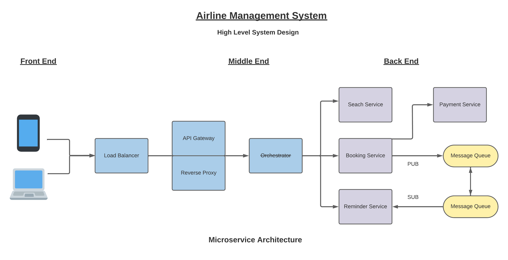

# Airline Management System

Requirements analysis is a critical process that plays a crucial role in assessing the success of a system or software project. Requirements can be broadly categorized into two types: Functional and Non-functional requirements.

## Functional Requirements

Functional requirements encompass the specific demands made by end users regarding the fundamental features that the system should provide. It is essential to incorporate all these functionalities into the system as part of the contractual agreement. These requirements are expressed in terms of input required by the system, the operations performed, and the expected output. Unlike non-functional requirements, functional requirements are directly visible in the final product, as they represent the user's stated needs.

## Non-Functional Requirements

Non-functional requirements primarily focus on the quality constraints that the system must fulfill based on the project contract. The priority and implementation of these factors may vary across different projects. They are also referred to as non-behavioral requirements and typically address issues such as:

Portability
Security
Maintainability
Reliability
Scalability
Performance
Reusability
Flexibility

By considering these non-functional requirements, the system can ensure it meets the necessary standards and provides a robust foundation for its functionality.

 

## Non-Functional Requirements of the Project:

1. User Interface and Search Functionality:

   - The system should prioritize providing efficient flight search capabilities over the booking process due to the higher frequency of flight searches compared to actual bookings.
   - The user interface should be intuitive and user-friendly, allowing users to easily search for flights based on criteria such as cheapest fares, minimum stops, and duration.

2. Reliability:

   - The system must ensure a reliable booking process, avoiding issues such as multiple deductions of money or instances where money is deducted but the booking is not confirmed.
   - It should provide a robust and stable platform for users to make successful bookings without encountering any technical or financial discrepancies.

3. Scalability:

   - The system should be designed to handle a large user base, accommodating an estimated total of 1 lakh (100,000) users.
   - It should be capable of managing a substantial number of bookings, with an expected quarter consisting of up to 1 lakh bookings.
   - The system should be able to handle a daily load of 100 bookings from registered users.

4. Price Stability during Booking:

   - The system should ensure that flight prices remain consistent throughout the booking process.
   - It should prevent price fluctuations during the payment transaction, guaranteeing that the price remains unchanged once the payment process begins.
   - Price changes, if any, should only occur before the payment process starts.

5. Auto-scaling:
   - The system should possess the ability to auto-scale itself to accommodate at least three times the current traffic load.
   - It should automatically adapt to increased traffic demands without compromising performance or user experience.
   - Auto-scaling capabilities will ensure the system remains responsive and functional during peak usage periods.

By incorporating these non-functional requirements, the airline management system can provide a reliable and user-friendly experience, handle a significant user base, maintain price stability during bookings, and scale dynamically to accommodate increased traffic.

 

## High Level System Design of Airline Management System

 

 

## Workflow of the Project

 

- The client does not directly interact with the server. Instead, the client sends a request to the `Load Balancer`. The `Load Balancer` is responsible for redirecting the request to the appropriate Internal Server based on availability and incoming requests. The main task of the `Load Balancer` is to balance the load across the entire architecture.

- Scale up the `Search Service` as it is expected to handle a significant amount of load.

- When a user makes a request to the `Search Service` and intends to start the booking process, the booking details will be transferred to the `Booking Service`, which will handle the booking process and maintain the booking information.

- An `API Gateway` serves as an intermediary between the client and the collection of backend services. Acting as a `Reverse Proxy`, the `API Gateway` accepts all Application Programming Interface (API) calls or requests and forwards them to specific services. These services aggregate the necessary data and return the requested results. The `Load Balancer` directs the request to the `API Gateway`, which contains the `Reverse Proxy` component.

- To avoid direct communication between the frontend and backend services, the frontend sends requests to a proxy, which determines the appropriate service (A, B, or C) to handle the request. After processing the request, the services send their responses to the `API Gateway`, which aggregates the responses and returns the results to the client.

- A `Reverse Proxy` server, typically located behind a firewall in a private network, directs client requests to the appropriate backend server. This type of proxy server adds an extra layer of abstraction and control to ensure smooth network traffic flow between clients and servers.

- `API Gateway` performs various tasks tasks:

  - Rate limitations

  - Authentication/Authorization

  - Data aggregation

- An additional layer, known as the `Orchestrator/Orchestration` Layer, exists between the API Gateway and the services. This layer is common in highly scalable applications and is responsible for managing the overall workflow of the system.

- A `Microservice Orchestration` pattern involves a central orchestration service, known as the orchestrator, which typically contains the entire business workflow logic. The orchestrator issues commands to worker microservices and awaits their responses. This pattern can be likened to an orchestra, where a central conductor keeps the musicians in sync and coordinates their actions to create a cohesive musical piece. Using orchestrators is crucial for effectively managing microservices-based applications.

- In our project, the `Booking Service` and the `Reminder Service` do not communicate directly. Asynchronous operations can be performed without immediate availability for sending messages or emails to users who have just booked a flight. To address this, we employ the use of a `Message Queue`. The `Booking Service` publishes a significant number of messages/emails to `Message Queues`, which collect and store these requests. The `Reminder Service`, when experiencing less load, retrieves/subscribes to the messages/emails from these `Message Queues`. This setup follows a `Publisher-Subscriber (Pub-Sub)` model, reducing strain on the `Reminder Service`. `Rabbit MQ` is the chosen messaging queue system for our project.

- The `Reminder Service` must send reminders/mail/messages to the user to do self-checking and get the boarding pass 48 hrs before their flight. How to handle that? We can schedule `Cron Jobs`. `Cron Jobs` are a standard method of scheduling tasks to run on your server. Cron is a service running in the background that will execute commands (jobs) at a specified time, or at a regular interval.

- How can we actually scale each service?

  We will deploy each and every service and in front of every service we will maintain a `LoadBalancer`. We will do **Autoscaling**. So there will be a `LoadBalancer` sitting in front of every service. We will just communicate with that particular `LoadBalancer` and that `LoadBalancer` will automatically redirect the request to one of the healthy servers of the corresponding service. E.g. 5 servers of the `Search Service` are currently running. 4 of them are busy and 1 is healthy. We made a request. The `LoadBalancer` of the `Search Service` will redirect the request to one of the healthy servers of the `Search Service`. We will maintain a `LoadBalancer` in front of each service.
